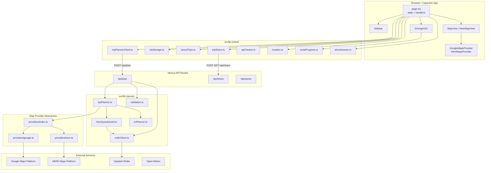
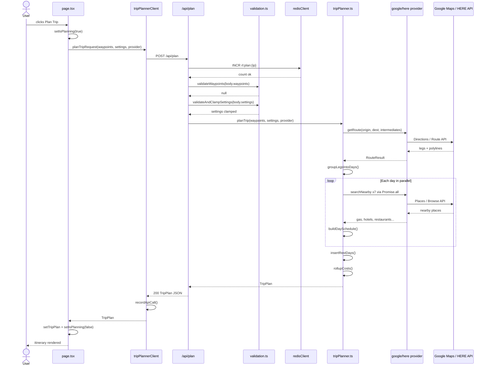
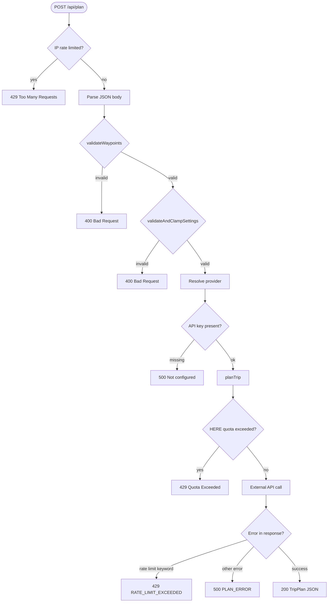
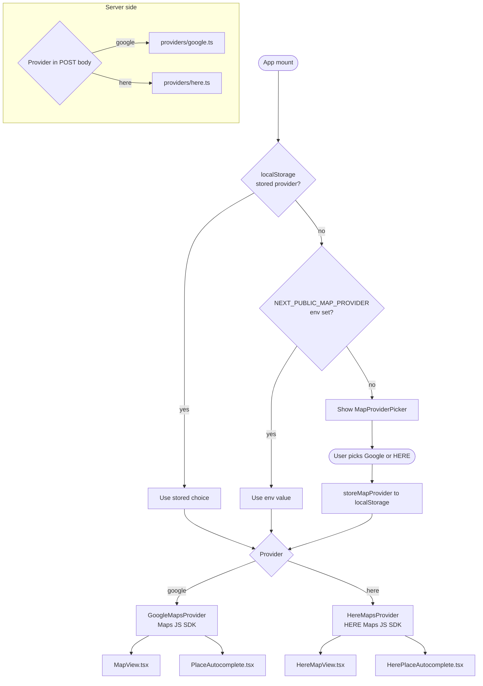
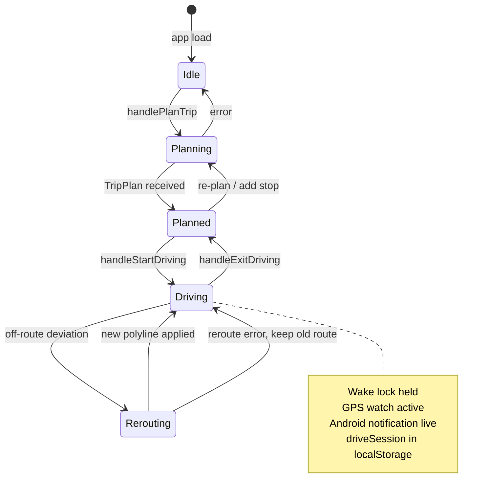
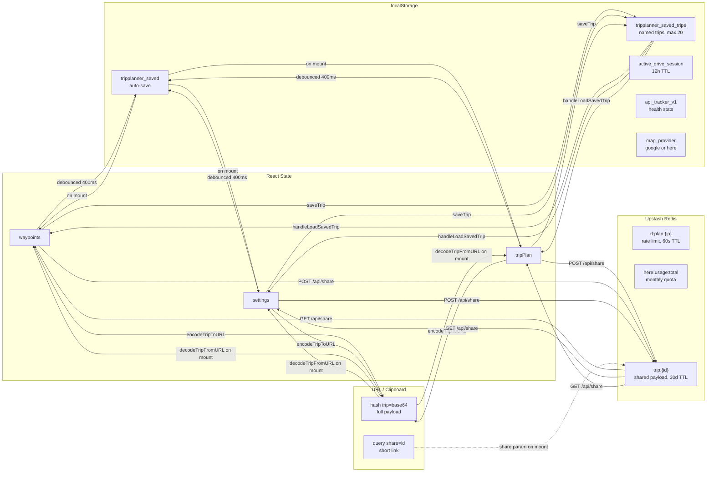
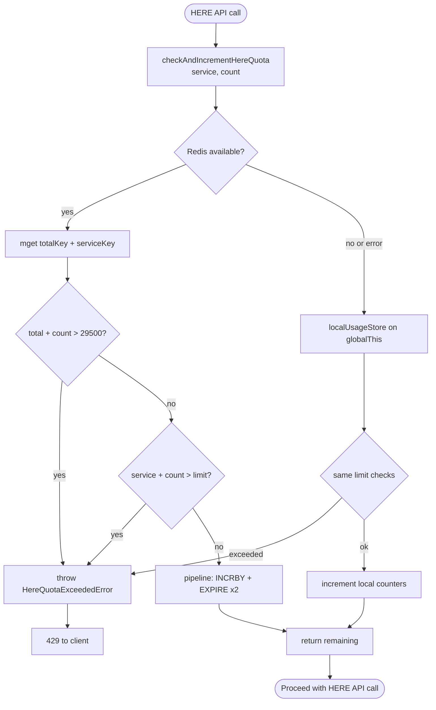

# TripPlanner — Code & Workflow Diagrams

---

## 1. System Architecture

---

## 2. Trip Planning Pipeline

---

## 3. API Request Lifecycle

---

## 4. Map Provider Strategy

---

## 5. Driving Mode State Machine

---

## 6. Data Persistence and Sharing

---

## 7. HERE Quota Guard Flow

